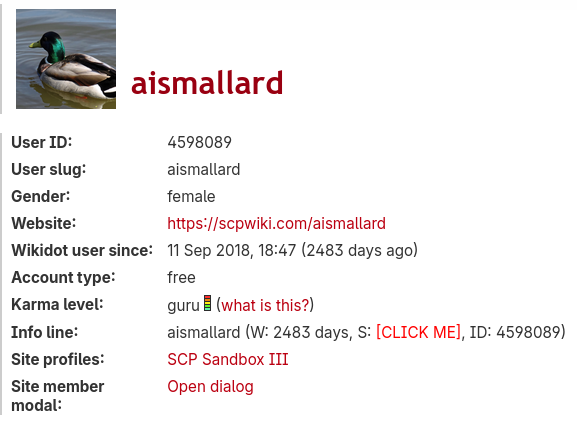
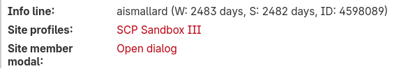
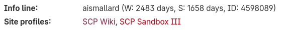

## Greasemonkey "More User Info" Script

This [Greasemonkey](https://www.greasespot.net/) userscript enhances the user info page on Wikidot (e.g. https://www.wikidot.com/user:info/aismallard) by exposing additional information about users.

It also exposes convenient links, one to navigate to the SCP Wiki or SCP Sandbox III user profile page and one to open the site member modal. If you are on a particular site, this shows you site-specific information like membership. This is primarily useful on per-site user pages like [on the SCP Wiki](https://scp-wiki.wikidot.com/system:user/aismallard).

Because getting the membership length depends on a different API call, we cannot populate it automatically. But if the user clicks on the text, they can prompt a call to fetch and display that information:

The list of site profiles is configured in the Javascript, and does not provide a link to the site you are already on.

Feel free to fork this script to change the exact links provided or to localize the text.

**You can [install the script](https://github.com/scpwiki/user-info-script/raw/refs/heads/main/user-info.user.js) here.**

Available under the MIT License.
